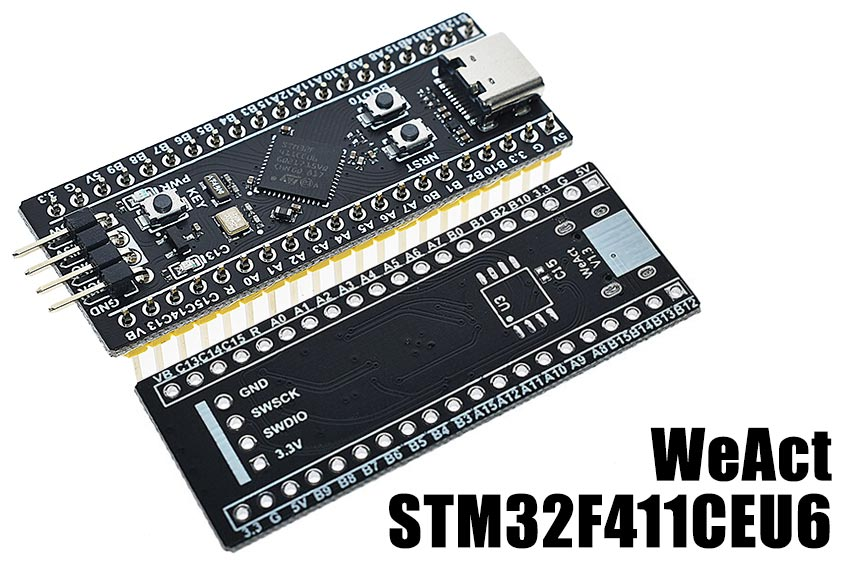

# WeAct STM32F411CEU6

MicroPython board definition files for the WeAct V1.3 STM32F411CEU6 dev board.



### Build the firmware

Clone the board definitions to your [MicroPython](https://github.com/micropython/micropython) `ports/stm32/boards` folder.

```bash
cd micropython/ports/stm32/boards
git clone https://github.com/mcauser/WEACT_F411CEU6.git

cd ..
make BOARD=WEACT_F411CEU6
```

### Flashing via DFU

This board can be flashed using DFU. To put the board in DFU mode, disconnect
USB, connect `A9` to `A10` and reconnect USB. Press and hold `BOOT0`. Press
and release `RESET`. Wait 0.5 seconds. Release `BOOT0`.

Now you can flash the board using USB with the command:

```bash
make BOARD=WEACT_F411CEU6 deploy
```

Once the upload is complete, disconnect USB, remove jumper between `A9`
and `A10`, then reconnect USB.

Alternatively, you can use the MicroPython command `pyb.bootloader()`
to get into DFU mode without needing to use the switch.

Currently, you need to unplug and replug the board in order to switch from DFU
mode back to regular mode.

### Accessing the board

Once built and deployed, you can access the MicroPython REPL (the Python prompt) via USB serial.

```bash
screen /dev/tty.usbmodem1422 115200
# or
screen /dev/ttyACM0 115200
```

### Specifications

* STM32F411CEU6 ARM Cortex M4
* 100MHz, 125 DMIPS / 1.25 DMIPS / MHz
* 1.7V - 3.6V operating voltage
* 25MHz system crystal
* 32.768KHz RTC crystal
* 2.54mm pitch pins
* JTAG/SWD header
* 512 KByte Flash, 128 KByte SRAM
* 5x SPI, 3x USART, 5x I2S, 3x I2C
* 1x SDIO
* 1x USB 2.0 FS
* (Unpopulated) Winbond W25Q32 32Mbit SPI Flash
* 1x ADC (12-bit / 16-channel)
* 6x general timers, 2x advanced timers
* USB-C for power and comms
* Red power LED
* Blue user LED (PC13) active low
* 1x button for bootloader selection
* Reset button, 1x user buttons KEY (PA0)
* 2x20 side pins + 1x4 ISP pins
* no mounting holes
* Dimensions: 52.81mm x 20.78mm

### Exposed Port Pins

* PA0-PA12, PA15
* PB0-PB10, PB12-PB15
* PC13-C15

### Peripherals

#### SPI Flash (U3) Unpopulated

* 1 PA4 CS
* 2 PA6 MISO
* 3 3V3 WP
* 4 GND GND
* 5 PA7 MOSI
* 6 PA5 SCK
* 7 3V3 HOLD
* 8 3V3 VCC

#### SWD debug (P3)

* 1 GND GND
* 2 PA14 SWCLK
* 3 PA13 SWDIO
* 4 3V3 VCC

#### USB-C (J1)

* 1 GND
* 2 VBUS 5V
* 3 PA11 USB_DN
* 4 PA12 USB_DP

#### User LED

* PC13 Blue LED

### Links

* [STM32F411CE on st.com](https://www.st.com/en/microcontrollers-microprocessors/stm32f411ce.html)
* Buy on [AliExpress] or search for "STM32F411CEU6"
* Buy on [Taobao](https://item.taobao.com/item.htm?id=596986293640)
* [STM32F411 datasheet](docs/STM32F411_datasheet.pdf)
* [STM32F411 reference manual](docs/STM32F411CEU6_manual.pdf)
* [STM32F411CEU6 schematics](docs/STM32F411CEU6_schematics.pdf)
* [STM32F411CEU6 PCB](docs/STM32F411CEU6_pcb.pdf)

### Related boards

* [MCUDev Black STM32F407VET6](https://github.com/mcauser/BLACK_F407VE)
* [MCUDev Black STM32F407ZET6](https://github.com/mcauser/BLACK_F407ZE)
* [MCUDev Black STM32F407ZGT6](https://github.com/mcauser/BLACK_F407ZG)
* [MCUDev DevEBox STM32F407VET6](https://github.com/mcauser/MCUDEV_DEVEBOX_F407VET6)
* [MCUDev DevEBox STM32F407VGT6](https://github.com/mcauser/MCUDEV_DEVEBOX_F407VGT6)
* [WeAct STM32F411CEU6](https://github.com/mcauser/WEACT_F411CEU6) - this board
* [VCC GND STM32F407VET6 Mini](https://github.com/mcauser/VCC_GND_F407VE)
* [VCC GND STM32F407ZGT6 Mini](https://github.com/mcauser/VCC_GND_F407ZG)

[AliExpress]: https://www.aliexpress.com/item/4000103610226.html

## License

Licensed under the [MIT License](http://opensource.org/licenses/MIT).
